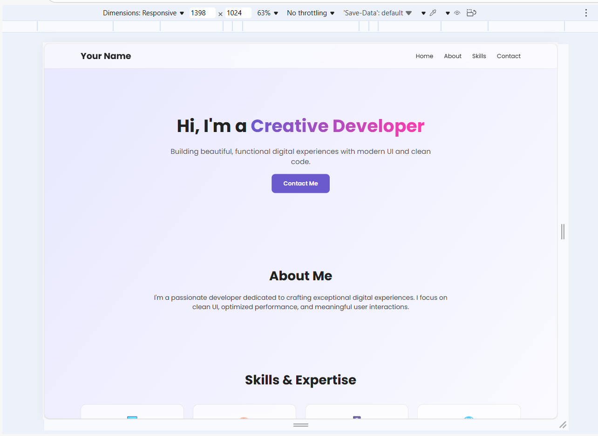
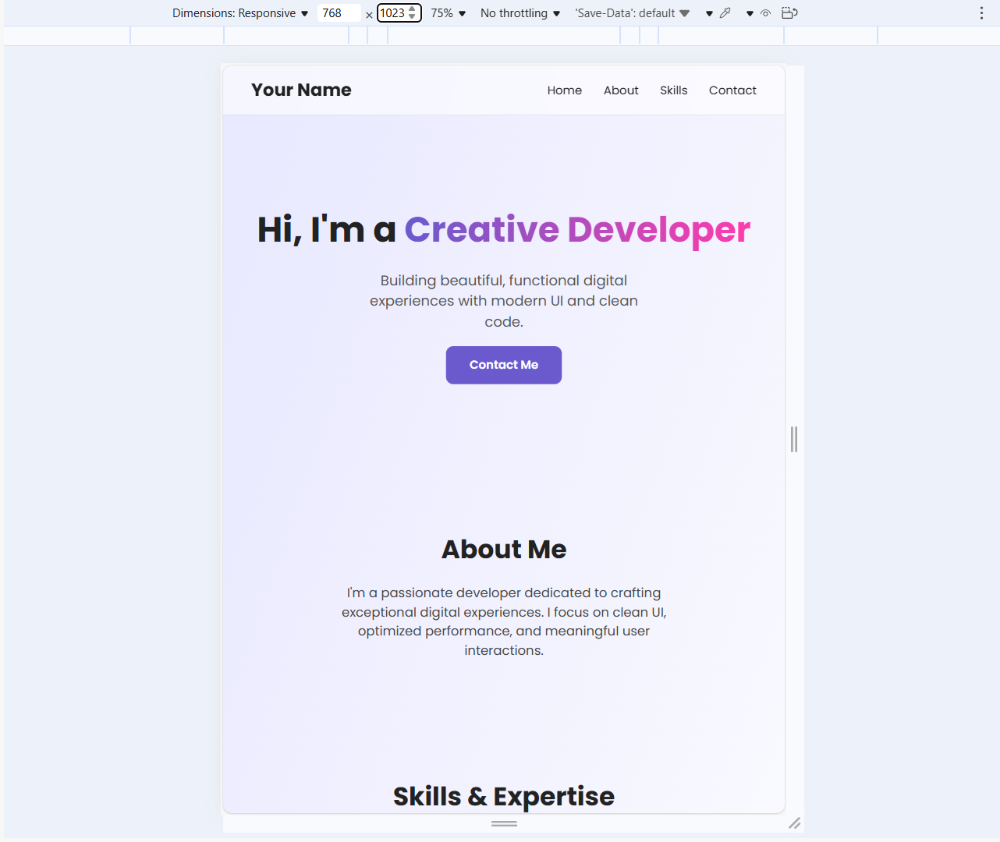
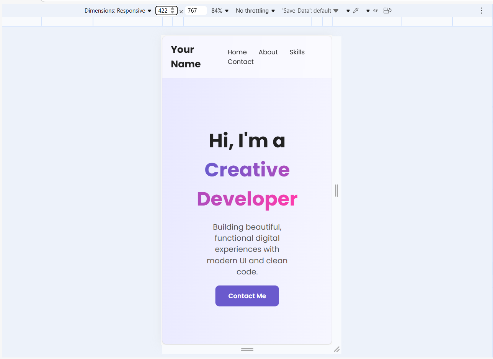

## Personal Portfolio Project
Welcome to my responsive personal portfolio! This project showcases my skills in web development, including layout design, responsiveness, and creative polish. It’s built using HTML and CSS, with thoughtful use of AI tools and manual refinements.

## AI Tool Usage
I used Lovable.AI to assist with:
- Generating the initial HTML structure for the homepage
- Creating a responsive CSS Grid layout for the founders section
- Suggesting hover effects and animation ideas

## Manual Improvements
After reviewing the AI-generated code, I made several custom changes:
- Refined grid responsiveness across breakpoints for better tablet/mobile experience
- Adjusted card sizing and spacing for visual balance
- Customized color theme to match my personal branding
- Added subtle animations to buttons and section transitions
- Improved accessibility with semantic tags and alt text
- Made it suitable for HTML + CSS only

### 📱 Screenshots

**Desktop View**  

**Tablet View**  

**Mobile View**  

